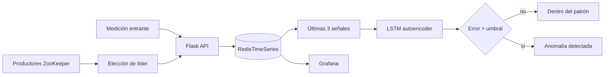

# Critical Signal

> Un laboratorio demostrable de desarrollo de software crítico: una medición entra, el sistema la contextualiza y una decisión operativa sale.

Este repositorio reúne el trabajo práctico de la asignatura en una historia técnica única. Combina modelos de detección de anomalías, una API Flask, persistencia temporal con RedisTimeSeries, observabilidad con Grafana, despliegue con Docker y coordinación distribuida con ZooKeeper.

La portada interactiva vive en `Containers and Deployment with Docker`. Está pensada para una demo de portfolio: permite enviar señales, ver la reconstrucción LSTM, comparar el error contra el umbral y explicar qué ocurre detrás de la interfaz.

## Por qué merece una conversación

- **Para una empresa:** enseña cómo aterrizar una técnica de ML en un servicio observable y desplegable.
- **Para una startup:** ofrece una base compacta para explorar señales de producto, operaciones o IoT sin perder trazabilidad.
- **Para una persona o equipo pequeño:** funciona como laboratorio didáctico y como pieza de portfolio con decisiones técnicas explicables.

## La demo en 90 segundos

Necesitas Docker Desktop con Compose.

```bash
docker compose -f "Containers and Deployment with Docker/docker-compose.demo.yml" up --build
```

Abre [http://localhost:4000](http://localhost:4000) y prueba, en este orden:

1. `70` varias veces para construir el contexto y generar una señal normal.
2. `445` para forzar una desviación evidente.
3. Consulta [http://localhost:4000/api/health](http://localhost:4000/api/health) para enseñar el estado de Redis y del modelo.

Para detener y limpiar la demo:

```bash
docker compose -f "Containers and Deployment with Docker/docker-compose.demo.yml" down
```

También puedes llamar a la API directamente:

```bash
curl -X POST http://localhost:4000/api/detect \
  -H "Content-Type: application/json" \
  -d '{"value": 72}'
```

La guía hablada para presentar el proyecto está en [`DEMO.md`](DEMO.md).

Para enseñar la parte distribuida con tres productores y elección de líder:

```bash
docker compose -f "Zookeeper/docker-compose.demo.yml" up --build
```

La API seguirá disponible en [http://localhost:4000](http://localhost:4000); los logs de `producer-1`, `producer-2` y `producer-3` permiten ver qué instancia es líder y cuándo envía la media.

## Cómo funciona



La decisión usa el error absoluto entre la reconstrucción del autoencoder y el valor recibido. El umbral se genera en el experimento del autoencoder y se conserva en `UmbralDeAnomalias.txt`. Si todavía no hay tres mediciones, la API responde `warming_up`: no inventa una predicción sin contexto.

## Qué contiene cada práctica

| Módulo | Qué demuestra | Entrada principal |
| --- | --- | --- |
| Detección con Machine Learning | Ventanas temporales y comparación entre LSTM, autoencoder e Isolation Forest | `Anomaly Detection with Machine Learning/modelosDeteccionAnomalias.py` |
| Contenedores y despliegue | API REST, RedisTimeSeries, dashboard y servicios Docker | `Containers and Deployment with Docker/` |
| Coordinación distribuida | Nodos efímeros, elección de líder y agregación de mediciones | `Zookeeper/practica3.py` |

## Resultados del experimento

Estas cifras son las anotadas durante la práctica sobre el dataset de temperatura incluido, no una promesa de rendimiento en producción.

| Modelo | Resultado observado | Lectura técnica |
| --- | ---: | --- |
| LSTM predictor | MAE ≈ 0,696 · 77 anomalías | Capta patrones temporales; mayor coste de entrenamiento |
| LSTM autoencoder | MAE ≈ 0,737 · 72 anomalías | Reconstruye secuencias; genera el umbral usado por la demo |
| Isolation Forest | 73 anomalías | Rápido y útil para valores extremos; menos sensible al contexto temporal |

La conclusión de la práctica fue elegir LSTM para contextualizar la señal, manteniendo los otros dos enfoques como comparación y herramienta de análisis.

## API de la demo

| Método | Ruta | Uso |
| --- | --- | --- |
| `GET` | `/` | Dashboard interactivo |
| `GET` | `/api/health` | Estado de Redis, modelo y configuración |
| `GET` | `/api/measurements?limit=40` | Últimas señales serializadas como JSON |
| `POST` | `/api/detect` | Guarda y analiza `{ "value": 72 }` |
| `POST` | `/api/reset` | Reinicia la serie de la demo |

Las rutas originales (`/nuevo`, `/listar`, `/detectar`, `/eliminarLista`) siguen disponibles para no romper la integración de ZooKeeper.

## Recorrido del repositorio

```text
.
├── Anomaly Detection with Machine Learning/
│   ├── datos.csv
│   └── modelosDeteccionAnomalias.py
├── Containers and Deployment with Docker/
│   ├── app.py
│   ├── templates/index.html
│   ├── static/app.css
│   ├── static/app.js
│   ├── modelo.keras
│   ├── UmbralDeAnomalias.txt
│   ├── docker-compose.demo.yml
│   └── docker-compose.yml
├── Zookeeper/
│   ├── practica3.py
│   └── docker-compose.yml
├── DEMO.md
└── README.md
```

## Lo que he aprendido

- Preparar datos temporales y crear ventanas para modelos recurrentes.
- Comparar un modelo supervisado, un autoencoder y un método de detección no supervisado.
- Convertir inferencia de ML en una API consumible por una interfaz y por otros servicios.
- Persistir series temporales, separar configuración por variables de entorno y exponer health checks.
- Empaquetar servicios con Docker y pensar en réplicas, observabilidad y dependencias.
- Coordinar productores distribuidos con nodos efímeros y una elección de líder en ZooKeeper.
- Explicar límites técnicos: validación temporal, calibración del umbral, seguridad y operación.

## Siguientes mejoras

El proyecto está preparado como entrega académica y demo técnica, no como sistema de producción. El siguiente salto sería separar train/validation/test por tiempo, versionar dependencias, añadir tests de contrato para la API, configurar Grafana como código, proteger endpoints y almacenar las decisiones de anomalía como eventos consultables.

## Licencia

Proyecto académico y portfolio personal. Añade aquí la licencia que quieras utilizar antes de publicar el repositorio fuera de un entorno de evaluación.
